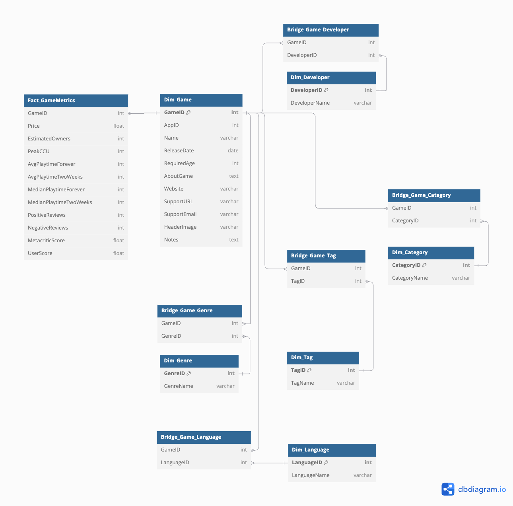

## Query Processing in a Data Warehouse for Steam Games Dataset

---

## Table of Contents

1. [Introduction](#introduction)
2. [How to Run the Project](#how-to-run-the-project)
   - [Prerequisites](#prerequisites)
   - [Step 1: Clone the Repository](#step-1-clone-the-repository)
     - [Using GitHub Desktop](#using-github-desktop-recommended-for-beginners)
     - [Using Git (Command Line)](#using-git-command-line)
   - [Step 2: Run the Docker Container](#step-2-run-the-docker-container)
   - [Step 3: Access the Database via Command Line](#step-3-access-the-database-via-command-line)
   - [Step 4: Set Up Poetry (For the ETL Pipeline)](#step-4-set-up-poetry-for-the-etl-pipeline)
   - [Step 5: Install Python Dependencies](#step-5-install-python-dependencies)
   - [Step 6: Run the ETL Pipeline](#step-6-run-the-etl-pipeline)
   - [Step 7: Stopping and Restarting the Docker Container](#step-7-stopping-and-restarting-the-docker-container)
   - [Step 8: Removing the Container (If Necessary)](#step-8-removing-the-container-if-necessary)
3. [Project Overview](#project-overview)
4. [Data Warehouse Design](#data-warehouse-design)
   - [Schema Diagram](#schema-diagram)
   - [Fact and Dimension Tables](#fact-and-dimension-tables)
     - [Fact Table: `Fact_GameMetrics`](#fact-table-fact_gamemetrics)
     - [Dimension Tables](#dimension-tables)
     - [Bridge Tables (for Many-to-Many Relationships)](#bridge-tables-for-many-to-many-relationships)
5. [ETL Pipeline](#etl-pipeline)
   - [Tools Used](#tools-used)
   - [Data Cleaning and Transformation Steps](#data-cleaning-and-transformation-steps)
     - [Load Data](#load-data)
     - [Handle Missing Values](#handle-missing-values)
     - [Convert Data Types](#convert-data-types)
     - [Handle Multi-Valued Fields](#handle-multi-valued-fields)
     - [Process `estimated_owners` Field](#process-estimated_owners-field)
     - [Normalize Data into Dimension Tables](#normalize-data-into-dimension-tables)
     - [Create Bridge Tables](#create-bridge-tables)
     - [Prepare Fact Table](#prepare-fact-table)
     - [Create `Dim_Date` Table](#create-dim_date-table)
     - [Data Validation](#data-validation)

---

## Introduction

This project involves building a data warehouse and developing an OLAP (Online Analytical Processing) application using a dataset of Steam games. The main objectives are to:

- Design a dimensional model (data warehouse) using a star schema.
- Perform ETL (Extract, Transform, Load) processes to populate the data warehouse.
- Develop an OLAP application that generates analytical reports using various OLAP operations.
- Apply query optimization strategies to improve the performance of the queries.

---

## How to Run the Project

This guide will walk you through setting up the Steam Games Data Warehouse, loading the database, and running the OLAP application. It covers both Windows and Unix-like systems (Linux/MacOS) and provides beginner-friendly instructions.

### Prerequisites:
- **Docker**: Download and install Docker from [here](https://www.docker.com/products/docker-desktop) based on your operating system.
- **GitHub Desktop** (optional for cloning the repository): [Download here](https://desktop.github.com/).
- **Python** and **Poetry** (for the ETL pipeline): [Poetry Installation Guide](https://python-poetry.org/docs/#installation).

---

### Step 1: Clone the Repository


#### Using GitHub Desktop (Recommended for Beginners):

1. **Download and Install GitHub Desktop**:
   - Download GitHub Desktop from [here](https://desktop.github.com/).

2. **Clone the Repository**:
   - Open GitHub Desktop.
   - Click on **File > Clone Repository**.
   - In the **URL** tab, paste the repository URL:

     ```
     https://github.com/JG8203/stadvdb-mco1-xx22-idk
     ```

   - Choose a local path to clone the repository, then click **Clone**.

#### Using Git (Command Line):

**Linux/MacOS**:
1. Open a terminal.
2. Run the following command to clone the repository:

   ```bash
   git clone https://github.com/JG8203/stadvdb-mco1-xx22-idk
   ```

**Windows** (Command Prompt or Git Bash):
1. Open Command Prompt, PowerShell, or Git Bash.
2. Run the following command:

   ```bash
   git clone https://github.com/JG8203/stadvdb-mco1-xx22-idk
   ```

---

### Step 2: Run the Docker Container

The project is packaged in a Docker container, making it easy to run without needing to manually set up the database environment.

1. **Open Terminal/Command Prompt**:
   - **Windows**: You can use Command Prompt, PowerShell, or Git Bash.
   - **Linux/MacOS**: Use your default terminal.

2. **Run the Docker Commands**:
   
   Pull the Docker image from Docker Hub:

   ```bash
   docker pull armaine/steam-dwh-mariadb:latest
   ```

3. **Run the Container**:
   
   After the image has been pulled, run the following command to start the MariaDB container:

   ```bash
   docker run -d --name steam-games-db -p 3306:3306 -e MARIADB_ROOT_PASSWORD=steam-dwh-pw armaine/steam-dwh-mariadb:latest
   ```

   - This runs the container in detached mode.
   - The root password for the MariaDB instance is set to `steam-dwh-pw`.

---

### Step 3: Access the Database via Command Line

After the Docker container is running, you can access the database directly using the command line.

1. **Open Terminal/Command Prompt**:
   - **Windows**: Command Prompt, PowerShell, or Git Bash.
   - **Linux/MacOS**: Default terminal.

2. **Connect to the MariaDB Database**:
   
   Run the following command to access the MariaDB instance running inside the Docker container:

   ```bash
   docker exec -it steam-games-db mariadb -u admin -p
   ```

3. **Enter Password**:
   
   When prompted, enter the password:

   ```
   password
   ```

You are now connected to the MariaDB instance running in Docker, and you can query the `games` database.

---

### Step 4: Set Up Poetry (For the ETL Pipeline)

Poetry is used to manage Python dependencies for running the ETL pipeline.

#### Poetry Installation:
1. **Linux/MacOS**:
   - Install Poetry by running the following command in your terminal:

     ```bash
     curl -sSL https://install.python-poetry.org | python3 -
     ```

2. **Windows**:
   - Download and install the Windows installer from [here](https://python-poetry.org/docs/#installation).

   Alternatively, you can use the following PowerShell command:

   ```bash
   (Invoke-WebRequest -Uri https://install.python-poetry.org -UseBasicParsing).Content | python -
   ```

After installing Poetry, you should be able to check that it's installed correctly by running:

```bash
poetry --version
```

---

### Step 5: Install Python Dependencies

Navigate to the directory where the repository was cloned, and install the dependencies using Poetry.

1. **Navigate to the Project Directory**:

   ```bash
   cd stadvdb-mco1-xx22-idk
   ```

2. **Install Dependencies**:

   Run the following command to install all the necessary Python packages:

   ```bash
   poetry install
   ```

---

### Step 6a: Run the ETL Pipeline
> [!CAUTION]
> DON'T RUN STEP 6a UNLESS NECESSARY. THE REQUIRED DATA WAS ALREADY INSERTED BY `MYSQLDUMP`. TELL THE GROUP IF YOU NEED TO MODIFY THE SCHEMA.
> THE SCRIPT BELOW POPULATES THE DATABASE WITH DATA FROM THE JSON FILE.

Now that the environment is set up, you can run the ETL pipeline to load and transform the Steam games data.

1. **Run the ETL Pipeline**:

   ```bash
   poetry run python etl/etl_pipeline.py
   ```

   This will clean, transform, and load the data into the database.

---

### Step 6b: Running Report Generation Pipeline

Once the ETL pipeline has been successfully run and the data is loaded into the database, you can generate analytical reports using the **Streamlit** application included in the project.

The **Streamlit** app is located in `dashboard.py` and serves as a front-end for viewing various OLAP reports generated from the data warehouse.

#### Steps to Run the Report Generation Pipeline:

1. **Activate the Poetry Environment**:
   - Ensure you are inside the project directory where `dashboard.py` is located.
   - Activate the Poetry environment by running:

     ```bash
     poetry shell
     ```

2. **Run the Streamlit Application**:

   To start the Streamlit dashboard, use the following command:

   ```bash
   streamlit run dashboard.py
   ```

   This command will launch the application in your default web browser, where you can interact with the generated OLAP reports.

3. **Access the Reports**:

   Once the Streamlit app is running, open your browser and go to the local URL (usually http://localhost:8501), where you will find various reports such as:

   - Game Sales and Performance Reports
   - Game Genre Analysis
   - Developer and Publisher Insights
   - User and Metacritic Reviews Breakdown
   - Price and Playtime Analytics

4. **Stop the Streamlit Application**:

   To stop the Streamlit app, simply press `Ctrl+C` in the terminal where the app is running.

---

### Step 7: Stopping and Restarting the Docker Container

Once you’re done using the database, you can stop or restart the Docker container as needed.

- **To Stop the Container**:
  
  Run this command:

  ```bash
  docker stop steam-games-db
  ```

- **To Start the Container Again** (without needing to re-pull or re-run the image):

  ```bash
  docker start steam-games-db
  ```

---

### Step 8: Removing the Container (If Necessary)

If you need to completely remove the container (for example, if you want to reset the data):

1. **Stop the container**:

   ```bash
   docker stop steam-games-db
   ```

2. **Remove the container**:

   ```bash
   docker rm steam-games-db
   ```

You can then re-run the container following Step 2 if needed.

---

## Project Overview

We will use the `games.csv` dataset, which contains information about Steam games, including details like game names, release dates, estimated owners, prices, developers, publishers, genres, platforms, and more.

The project involves the following steps:

1. **Data Warehouse Design**: Define fact and dimension tables based on the dataset.
2. **ETL Pipeline**: Use Python with pandas for data cleaning and PeeWee ORM for database operations.
3. **OLAP Reports**: Generate reports using OLAP operations such as roll-up, drill-down, slice, dice, and pivot.
4. **Query Optimization**: Apply strategies like indexing and query restructuring to optimize query performance.
5. **Visualization**: Use appropriate tools to visualize the analytical reports.

---

## Data Warehouse Design

### Schema Diagram

 

---

### Fact and Dimension Tables

#### Fact Table: `Fact_GameMetrics`

- **Measures**:
  - `Price`
  - `EstimatedOwners`
  - `PeakCCU`
  - `AvgPlaytimeForever`
  - `AvgPlaytimeTwoWeeks`
  - `MedianPlaytimeForever`
  - `MedianPlaytimeTwoWeeks`
  - `PositiveReviews`
  - `NegativeReviews`
  - `MetacriticScore`
  - `UserScore`
- **Foreign Keys**:
  - `GameID` (links to `Dim_Game`)

#### Dimension Tables

1. **Dim_Game**
   - `GameID` (Primary Key)
   - `AppID` (Unique)
   - `Name`
   - `ReleaseDate`
   - `RequiredAge`
   - `AboutGame`
   - `Website`
   - `SupportURL`
   - `SupportEmail`
   - `HeaderImage`
   - `Notes`

2. **Dim_Developer**
   - `DeveloperID` (Primary Key)
   - `DeveloperName` (Unique)

3. **Dim_Publisher**
   - `PublisherID` (Primary Key)
   - `PublisherName` (Unique)

4. **Dim_Genre**
   - `GenreID` (Primary Key)
   - `GenreName` (Unique)

5. **Dim_Category**
   - `CategoryID` (Primary Key)
   - `CategoryName` (Unique)

6. **Dim_Language**
   - `LanguageID` (Primary Key)
   - `LanguageName` (Unique)

7. **Dim_Tag**
   - `TagID` (Primary Key)
   - `TagName` (Unique)

#### Bridge Tables (for Many-to-Many Relationships)

- **Bridge_Game_Developer**
  - `GameID` (links to `Dim_Game`)
  - `DeveloperID` (links to `Dim_Developer`)
  - **Indexes**: `(GameID, DeveloperID)` (unique)

- **Bridge_Game_Publisher**
  - `GameID` (links to `Dim_Game`)
  - `PublisherID` (links to `Dim_Publisher`)
  - **Indexes**: `(GameID, PublisherID)` (unique)

- **Bridge_Game_Genre**
  - `GameID` (links to `Dim_Game`)
  - `GenreID` (links to `Dim_Genre`)
  - **Indexes**: `(GameID, GenreID)` (unique)

- **Bridge_Game_Category**
  - `GameID` (links to `Dim_Game`)
  - `CategoryID` (links to `Dim_Category`)
  - **Indexes**: `(GameID, CategoryID)` (unique)

- **Bridge_Game_Language**
  - `GameID` (links to `Dim_Game`)
  - `LanguageID` (links to `Dim_Language`)
  - **Indexes**: `(GameID, LanguageID)` (unique)

- **Bridge_Game_Tag**
  - `GameID` (links to `Dim_Game`)
  - `TagID` (links to `Dim_Tag`)
  - **Indexes**: `(GameID, TagID)` (unique)

--- 

## ETL Pipeline

### Tools Used

- **Python**: Main programming language.
- **Pandas**: For data cleaning and transformation.
- **PeeWee ORM**: For interacting with the MySQL database.
- **MySQL**: Database management system.
- **MySQL Workbench**: For database administration and schema design.

### Data Cleaning and Transformation Steps

1. **Load Data**: Load the `games.json` file into a pandas DataFrame.

2. **Handle Missing Values**:
   - Identify and display missing values per column.
   - Convert `release_date` to datetime, handling any parsing errors.
   - Ensure critical fields such as `AppID` and `name` do not have missing values.

3. **Convert Data Types**:
   - Convert boolean fields (`windows`, `mac`, `linux`) to boolean types.
   - Convert numeric fields like `price`, `dlc_count`, `achievements`, etc., to appropriate numeric types, replacing invalid entries with defaults.

4. **Handle Multi-Valued Fields**:
   - Clean fields like `developers`, `publishers`, `genres`, `categories`, and `supported_languages` by ensuring they are represented as lists. 
   - Normalize and clean each value in these lists.

5. **Process `estimated_owners` Field**:
   - Split the range values in `estimated_owners` into minimum and maximum fields.
   - Calculate the midpoint as a numeric estimate.

6. **Normalize Data into Dimension Tables**:
   - Separate the cleaned data into dimension tables for `Game`, `Developer`, `Publisher`, `Genre`, `Category`, `Language`, and `Tag`.
   - Extract unique entries for each dimension to ensure a normalized schema.

7. **Create Bridge Tables**:
   - Establish many-to-many relationships between games and their attributes by creating bridge tables (e.g., `BridgeGameDeveloper`, `BridgeGamePublisher`).

8. **Prepare Fact Table**:
   - Extract and clean relevant metrics like `price`, `estimated_owners`, `playtime`, and `reviews`.
   - Ensure `AppID` maps correctly to the `GameID` in the fact table.

9. **Create `Dim_Date` Table**:
   - Derive a date dimension table with fields for `Day`, `Month`, `Year`, `Quarter`, and `Weekday` from `release_date`.
   - Ensure `DateID` is in the `YYYYMMDD` format for indexing.

10. **Data Validation**:
    - Check for duplicates across all tables.
    - Ensure referential integrity between fact and dimension tables, verifying that every foreign key matches a valid entry in its respective dimension.
